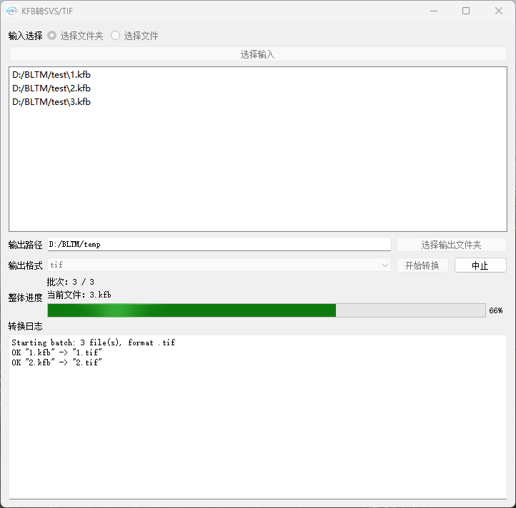
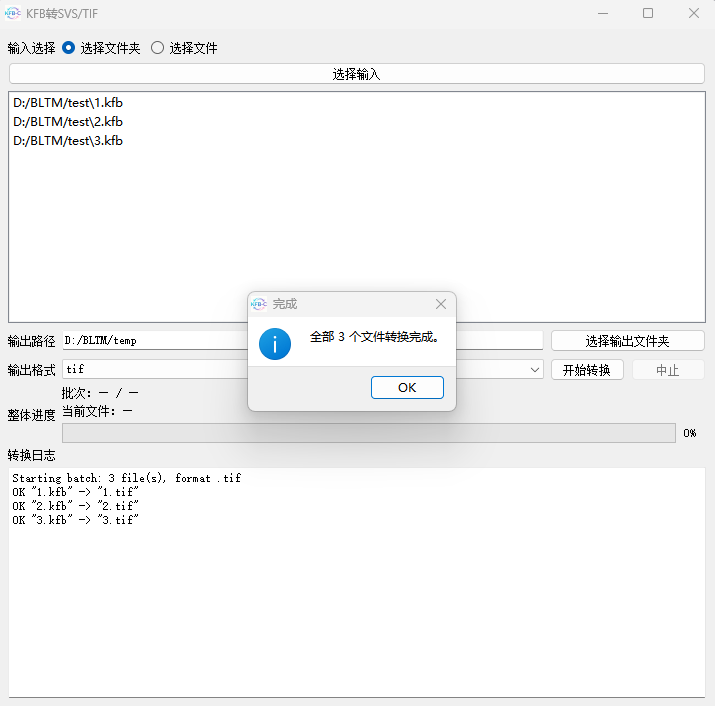

# KFB 批量转换
> 本软件目前仅支持 Windows 系统使用  
> 若工具有所帮助，欢迎点击右上角star⭐️收藏支持

## 界面使用样例

**转换进行中**



**转换结束**



## 功能

- **输入**：选择文件夹（扫描该目录下 `*.kfb`）或一次选取多个 KFB 文件；已选文件列表可预览
- **输出**：指定输出目录；格式可选 **SVS** 或 **TIF**
- **转换**：开始批量转换；可中止当前正在处理的文件（已完成文件保留）
- **进度与日志**：显示批次序号、当前文件名、整体进度条；底部日志面板输出转换过程信息。若本次**只转换一个** KFB 文件，整体进度条可能在转换完成前进度几乎不动，结束后会一下子跳到 100%——整体进度按「已完成文件数 / 总文件数」推进，单文件时只有该文件完成才算一步，不会随单文件内部进度平滑变化


## Quick Start
```python
# 获取源码
git clone https://github.com/JW-Yuan/kfb_2_svs_tif.git
cd kfb_2_svs_tif
# 安装依赖
conda create -n kfb-py308 python=3.8 -y
conda activate kfb-py308
pip install -r requirements.txt
# 运行
python main.py
```


## 致谢

本项目在 [tcmyxc/kfb2svs](https://github.com/tcmyxc/kfb2svs) 的基础上改进，特此致谢上游作者。